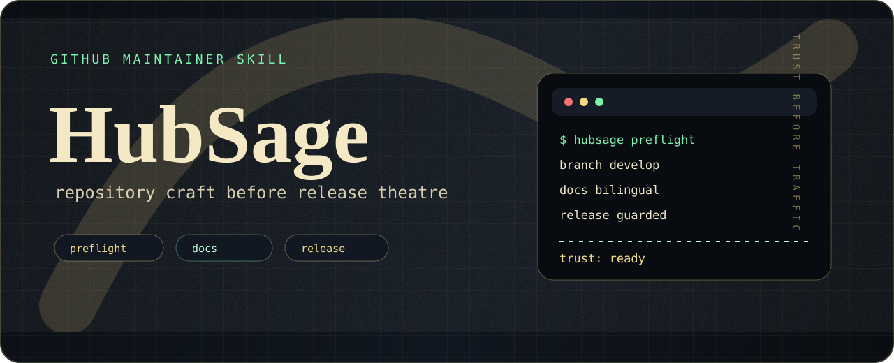
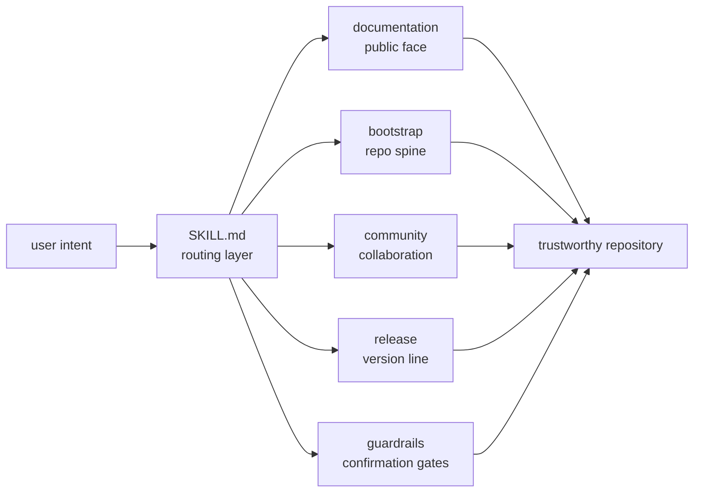

<div align="center">
  
</div>

<div align="center">

[](https://opensource.org/licenses/MIT)
[](https://github.com/Liii8888/HubSage/releases/tag/v1.3.0)
[](SKILL.md)
[](CONTRIBUTING.md)

**HubSage makes a repository feel maintained before anybody has to ask whether it is.**<br>
它不是写业务代码的助手，而是开源仓库的门面、秩序和发布纪律。

[Install](#install) · [What It Changes](#what-it-changes) · [System Map](#system-map) · [Release Discipline](#release-discipline)

</div>

---

## What It Changes

Most repositories do not fail because the code is impossible to understand. They fail because everything around the code feels unfinished: a thin README, loose commits, missing release notes, vague contribution rules, and public GitHub actions done a little too casually.

HubSage is the maintainer ritual around that problem. It gives an AI agent a strict, tasteful workflow for making GitHub repositories presentable, auditable, and harder to release carelessly.

| Without HubSage | With HubSage |
| --- | --- |
| README as an afterthought | README as the public doorway |
| `update` / `misc` commits | Gitmoji + Conventional Commits |
| Release notes written from memory | Release notes derived from actual history |
| Public actions by impulse | Push, tag, repo creation, and release behind confirmation |
| One long prompt file | Routed skill with focused references |

## The Maintainer Stack

| Layer | File | Job |
| --- | --- | --- |
| Command surface | `SKILL.md` | Routes requests, defines guardrails, keeps the agent disciplined |
| Documentation craft | `references/documentation.md` | README, CONTRIBUTING, badges, architecture diagrams |
| Repository bootstrap | `references/bootstrap.md` | `.gitignore`, license guidance, first commit, remote setup |
| Community posture | `references/community.md` | Issue templates, PR templates, conduct guidance, safe Actions |
| Release discipline | `references/release.md` | Version notes, changelog, tags, GitHub Releases |
| Codex presentation | `agents/openai.yaml` | UI metadata for the installed skill |

## System Map



## Install

Install HubSage as a Codex skill:

```bash
git clone https://github.com/Liii8888/HubSage.git
mkdir -p ~/.codex/skills/HubSage
cp -R HubSage/SKILL.md HubSage/references HubSage/agents ~/.codex/skills/HubSage/
```

Then speak to the agent like a maintainer, not a config file:

```text
使用 HubSage 规范化当前 GitHub 仓库，并准备下一版 Release Notes。
```

```text
Use HubSage to polish this repository and prepare a safe release flow.
```

## Release Discipline

HubSage uses a two-speed release model:

| Change | Where it goes | What happens |
| --- | --- | --- |
| Small evolution | `CHANGELOG.md#Unreleased` and `origin/develop` | Recorded, pushed, not released |
| Behavior-level update | Versioned changelog section | Release branch, annotated tag, GitHub Release |

Latest release: [`v1.3.0`](https://github.com/Liii8888/HubSage/releases/tag/v1.3.0).

## Repository Shape

```text
HubSage/
├── assets/                   # Visual identity for the repository
├── SKILL.md                  # Routing layer and operating rules
├── references/               # Progressive workflow details
├── agents/openai.yaml        # Codex UI metadata
├── CHANGELOG.md              # Small-update ledger and release source
├── CONTRIBUTING.md           # Contribution and validation guide
└── README.md                 # Public-facing project doorway
```

## Contributing

Keep changes narrow, auditable, and recorded. If a change alters behavior, release flow, public docs, or safety boundaries, update [CHANGELOG.md](CHANGELOG.md) before opening the PR.
