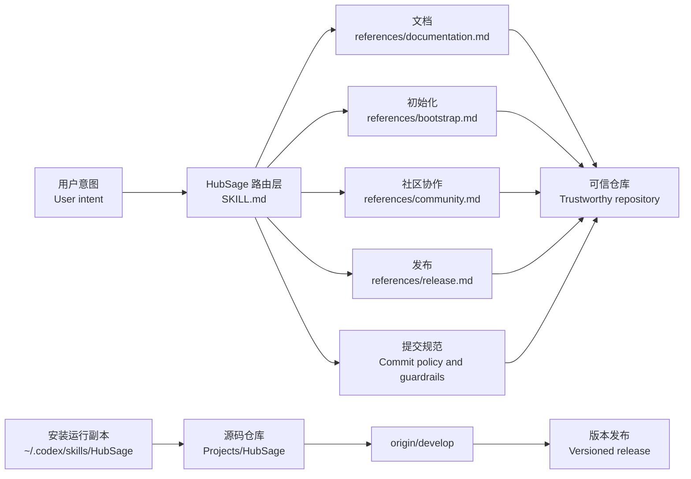

<div align="center">

# HubSage

**让 GitHub 仓库在请求信任之前，先把自己维护得值得信任。**

**A maintainer-grade Agent Skill for GitHub repositories that need to look trustworthy before they ask for trust.**

[](https://opensource.org/licenses/MIT)
[](CHANGELOG.md)
[](SKILL.md)
[](CONTRIBUTING.md)

[概览](#概览--overview) · [能力矩阵](#能力矩阵--capability-matrix) · [架构](#架构--architecture) · [安装](#安装--install) · [发布节奏](#发布节奏--release-rhythm)

</div>

---

## 概览 / Overview

HubSage 是一个面向 GitHub / 开源仓库维护的 Agent Skill。它不替你写产品业务，而是把产品外侧的维护工作做稳：仓库初始化、README 和 CONTRIBUTING、社区模板、提交规范、变更记录、发布说明，以及公开 GitHub 操作前的确认护栏。

HubSage is a GitHub maintenance Agent Skill for shell-capable AI agents. It does not try to write the product for you. It shapes the work around the product: repository bootstrap, README and CONTRIBUTING polish, community templates, commit hygiene, changelog discipline, release notes, and confirmation gates before public GitHub actions.

它适合那些“代码可能已经能跑，但仓库还不够可信”的项目：新读者需要快速看懂项目，贡献者需要知道怎么参与，维护者需要在发版时知道哪些动作已经验证、哪些动作必须确认。

It is designed for projects where the code may already work, but the repository is not yet easy to trust. New readers should understand the project quickly, contributors should know how to participate, and maintainers should know what has been verified before a release.

> 简单说：让仓库更容易被理解、更容易协作，也更不容易草率发布。
>
> In short: make a repository easier to understand, easier to contribute to, and harder to release carelessly.

## 能力矩阵 / Capability Matrix

| 领域 / Area | HubSage 会处理 / What HubSage handles | 护栏 / Guardrail |
| --- | --- | --- |
| 仓库预检 / Repository preflight | 检查分支、远端、脏工作区、最近 tag、包管理文件和 `gh` 状态。 / Checks branch, remote, dirty worktree, recent tags, package files, and `gh` status. | 不隐藏本地改动或未知状态。 / Never hides local changes or unknown state. |
| 文档 / Documentation | 生成或打磨双语 README、CONTRIBUTING、真实徽章和 Mermaid 图。 / Creates or polishes bilingual README, CONTRIBUTING, real badges, and Mermaid diagrams. | 不伪造徽章、功能、性能或未验证命令。 / No fake badges, claims, benchmarks, or unverified commands. |
| 社区文件 / Community files | 添加 Issue 模板、PR 模板、行为准则和轻量 Actions。 / Adds issue templates, PR templates, conduct guidance, and lightweight Actions. | Actions 权限保持最小化。 / Keeps Actions permissions narrow. |
| 提交卫生 / Commit hygiene | 使用 Gitmoji + Conventional Commits，并帮助拆分主题。 / Uses Gitmoji + Conventional Commits and helps keep commits scoped. | 拒绝 `update`、`misc`、`fix stuff` 这类不可检索提交。 / Rejects vague messages such as `update`, `misc`, or `fix stuff`. |
| 发布流 / Release flow | 整理版本说明、变更日志、tag 和 GitHub Release。 / Prepares version notes, changelog entries, tags, and GitHub Releases. | 公开动作前必须确认。 / Requires confirmation before public actions. |
| 技能维护 / Skill evolution | 同步安装副本、维护 `CHANGELOG.md#Unreleased`，并按 `develop` 优先节奏积累小更新。 / Syncs installed copies, maintains `CHANGELOG.md#Unreleased`, and records small changes on a develop-first rhythm. | 行为级变化才进入正式发布。 / Formal releases are reserved for behavior-level changes. |

## 架构 / Architecture



中文读法：`SKILL.md` 只负责判断请求类型和执行边界，详细流程拆到 `references/`，这样维护者可以在不弄乱入口文件的情况下继续扩展文档、初始化、社区模板和发布流程。

In English: `SKILL.md` stays as the routing and operating layer, while detailed procedures live under `references/`. This keeps the entry point small and lets maintainers evolve documentation, bootstrap, community, and release workflows separately.

## 安装 / Install

把这个仓库当作可复现的技能源码，然后安装到 Codex skills 目录：

Use this repository as the reproducible skill source, then install it into Codex:

```bash
git clone https://github.com/Liii8888/HubSage.git
mkdir -p ~/.codex/skills/HubSage
cp -R HubSage/SKILL.md HubSage/references HubSage/agents ~/.codex/skills/HubSage/
```

自然调用即可：

Invoke it naturally:

```text
使用 HubSage 规范化当前 GitHub 仓库，并更新 README、CONTRIBUTING 和发布节奏。
```

```text
Use HubSage to standardize this GitHub repository and prepare the next release notes.
```

## 发布节奏 / Release Rhythm

HubSage 使用两档维护节奏：小更新先进入 `develop` 并记录到 `CHANGELOG.md#Unreleased`；只有行为级变化才整理成正式 tag 和 GitHub Release。

HubSage uses a two-speed maintenance model: small updates land on `develop` and are recorded under `CHANGELOG.md#Unreleased`; behavior-level changes are promoted into a formal tag and GitHub Release.

| 更新类型 / Update type | 去向 / Destination | 发布动作 / Release action |
| --- | --- | --- |
| 小演进 / Small evolution | 记录到 `CHANGELOG.md#Unreleased`，提交并推送 `origin/develop`。 / Record under `CHANGELOG.md#Unreleased`, commit, and push `origin/develop`. | 不打 tag，不发 GitHub Release。 / No tag and no GitHub Release. |
| 行为级更新 / Behavior-level update | 把 `Unreleased` 提升成带日期的版本段落。 / Promote `Unreleased` into a dated version section. | 创建 release branch、annotated tag 和 GitHub Release。 / Create a release branch, annotated tag, and GitHub Release. |

当前下一个正式发布候选仍默认是 `v1.3.0`，因为渐进式 references、发布护栏和 Codex UI 元数据属于行为级升级。维护者可以在发布前根据实际变更调整版本号。

The next formal release candidate still defaults to `v1.3.0`, because the progressive references, release guardrails, and Codex UI metadata are behavior-level upgrades. Maintainers can adjust the version before publishing if the actual change set shifts.

## 仓库结构 / Repository Map

```text
HubSage/
├── SKILL.md                  # 路由层和操作规则 / Routing layer and operating rules
├── references/               # 渐进工作流细节 / Progressive workflow details
├── agents/openai.yaml        # Codex UI 元数据 / Codex UI metadata
├── CHANGELOG.md              # 小更新台账和发版来源 / Small-update ledger and release source
├── CONTRIBUTING.md           # 贡献与验证指南 / Contribution and validation guide
└── README.md                 # 对外项目入口 / Public-facing project doorway
```

## 贡献 / Contributing

欢迎 PR。请先阅读 [CONTRIBUTING.md](CONTRIBUTING.md)，保持改动聚焦；当行为、发布流程、公开文档或安全边界变化时，同步更新 [CHANGELOG.md](CHANGELOG.md)。

PRs are welcome. Read [CONTRIBUTING.md](CONTRIBUTING.md), keep changes scoped, and update [CHANGELOG.md](CHANGELOG.md) whenever behavior, release flow, public docs, or safety boundaries change.
