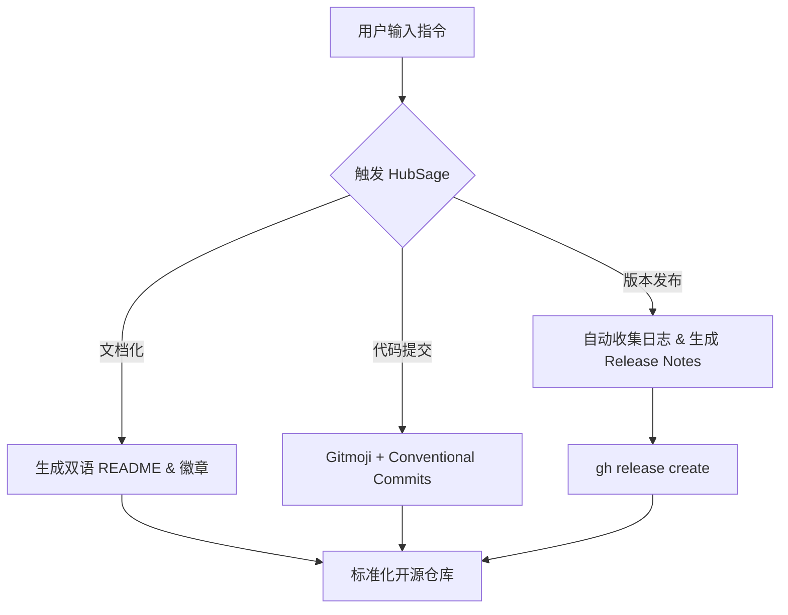
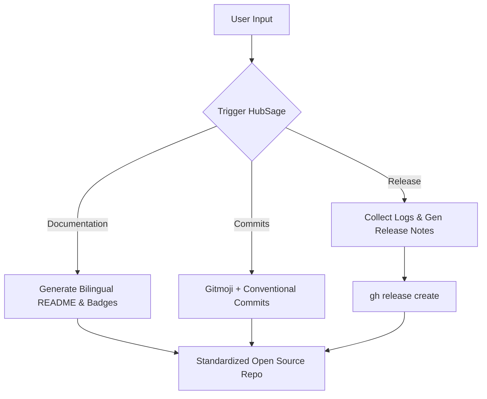

# 🤖 HubSage

[](https://opensource.org/licenses/MIT)
[](http://makeapullrequest.com)

[English](#english) | [中文](#chinese)

---

<a name="chinese"></a>
## 📖 简介 (Introduction)

HubSage 是一个通用的专业开源项目维护者技能（Agent Skill），适用于各类具备 Shell 执行能力的 AI Agent。它能够帮助你以专业的开源作者标准（如 Gitmoji 规范、中英双语文档、生成徽章和 Release Notes）自动化管理仓库、编写文档并执行版本发布。

### 🏗 架构 / 工作流 (Architecture)



### 🚀 快速开始 (Quick Start)

**安装技能：**
在终端中唤醒你的 AI Agent 并输入以下指令，让其自动下载并配置此技能：

```text
下载这个 Skills：https://github.com/Liii8888/HubSage
```

**使用技能：**
配置完成后，你可以向 Agent 发送如下指令来管理你的项目：

```text
使用 HubSage 规范化当前开源项目，并生成双语 README
```

### 🤝 参与贡献

欢迎提交 PR！请查阅我们的 [贡献指南 (CONTRIBUTING.md)](CONTRIBUTING.md) 了解更多分支规范与提交流程。

---

<a name="english"></a>
## 📖 Introduction

HubSage is a professional open-source project maintainer skill (Agent Skill) designed for AI Agents with Shell execution capabilities. It helps you automate repository management, write documentation, and execute releases using professional open-source standards (such as Gitmoji, bilingual documentation, badges, and release notes).

### 🏗 Architecture / Workflow



### 🚀 Quick Start

**Installation:**
Launch your AI Agent in the terminal and input the following prompt to let it download and configure the skill automatically:

```text
Download this skill: https://github.com/Liii8888/HubSage
```

**Usage:**
Once configured, you can manage your project by sending a prompt like this:

```text
Use HubSage to standardize the current open-source project and generate a bilingual README
```

### 🤝 Contributing

PRs are welcome! Please check out our [Contributing Guidelines (CONTRIBUTING.md)](CONTRIBUTING.md) for more details on branching and commit workflows.