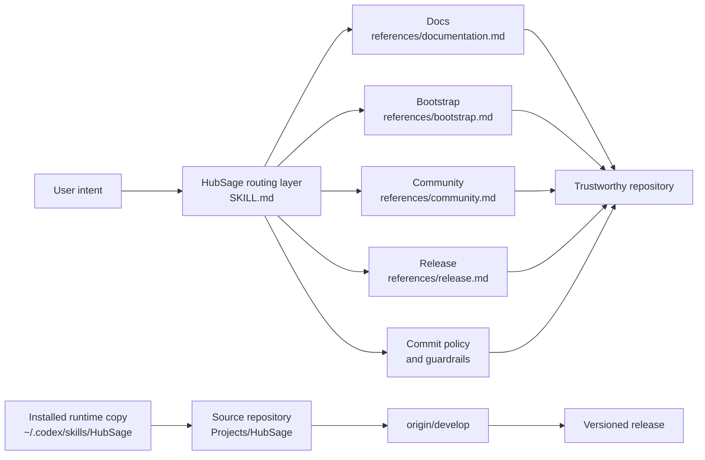

<div align="center">

# HubSage

**A maintainer-grade Agent Skill for GitHub repositories that need to look trustworthy before they ask for trust.**

一个面向 GitHub / 开源仓库维护的 Agent Skill：把 README、贡献流程、提交规范、发布节奏和 GitHub 护栏做稳。

[](https://opensource.org/licenses/MIT)
[](CHANGELOG.md)
[](SKILL.md)
[](CONTRIBUTING.md)

[Overview](#overview) · [Capability Matrix](#capability-matrix) · [Architecture](#architecture) · [Install](#install) · [Release Rhythm](#release-rhythm)

</div>

---

## Overview

HubSage is a GitHub maintenance skill for shell-capable AI agents. It does not try to write your product for you. It shapes the work around the product: repository bootstrap, documentation polish, community templates, commit hygiene, release notes, and confirmation gates before public GitHub actions.

HubSage 是一个给 Agent 使用的仓库维护技能。它不接管业务代码，而是把项目对外展示与协作流转做得更可信：初始化、文档、模板、提交、发版、变更记录，以及公开操作前的确认护栏。

> The promise is simple: make a repository easier to trust, easier to contribute to, and harder to release carelessly.

## Capability Matrix

| Area | What HubSage handles | Guardrail |
| --- | --- | --- |
| Repository preflight | Branch, remote, dirty worktree, recent tags, package files, `gh` status | Never hides local changes or unknown state |
| Documentation | Bilingual README, CONTRIBUTING, badges, Mermaid diagrams | No fake badges, claims, or unverified commands |
| Community files | Issue templates, PR template, conduct guidance, lightweight Actions | Keeps Actions permissions narrow |
| Commit hygiene | Gitmoji + Conventional Commits | Rejects vague commit messages and mixed-topic commits |
| Release flow | Version bump notes, changelog, tag, GitHub Release | Requires confirmation before public actions |
| Skill evolution | Installed-copy sync, `CHANGELOG.md#Unreleased`, `origin/develop` pushes | Formal releases only for behavior-level changes |

## Architecture



## Install

Use this repository as the reproducible source for the skill, then install it into Codex:

```bash
git clone https://github.com/Liii8888/HubSage.git
mkdir -p ~/.codex/skills/HubSage
cp -R HubSage/SKILL.md HubSage/references HubSage/agents ~/.codex/skills/HubSage/
```

Then invoke it naturally:

```text
使用 HubSage 规范化当前 GitHub 仓库，并更新 README、CONTRIBUTING 和发布节奏。
```

Or in English:

```text
Use HubSage to standardize this GitHub repository and prepare the next release notes.
```

## Release Rhythm

HubSage uses a two-speed maintenance model:

| Update type | Destination | Release action |
| --- | --- | --- |
| Small evolution | Record under `CHANGELOG.md#Unreleased`, commit, push `origin/develop` | No tag, no GitHub Release |
| Behavior-level update | Promote `Unreleased` into a dated version section | Release branch, annotated tag, GitHub Release |

The latest formal release is `v1.3.0`, which promotes the progressive references, release guardrails, Codex UI metadata, changelog ledger, and editorial repository presentation into the public release line.

## Repository Map

```text
HubSage/
├── SKILL.md                  # Routing layer and operating rules
├── references/               # Progressive workflow details
├── agents/openai.yaml        # Codex UI metadata
├── CHANGELOG.md              # Small-update ledger and release source
├── CONTRIBUTING.md           # Contribution and validation guide
└── README.md                 # Public-facing project doorway
```

## Contributing

PRs are welcome. Read [CONTRIBUTING.md](CONTRIBUTING.md), keep changes scoped, and update [CHANGELOG.md](CHANGELOG.md) whenever behavior, release flow, public docs, or safety boundaries change.
