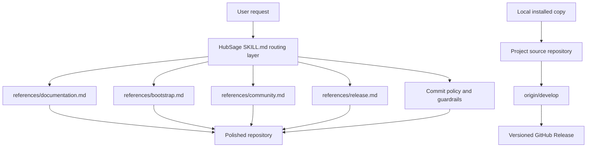

# HubSage

[](https://opensource.org/licenses/MIT)
[](http://makeapullrequest.com)

[English](#english) | [中文](#chinese)

---

<a name="chinese"></a>
## 简介 / Introduction

HubSage 是一个面向 GitHub 与开源项目维护的 Agent Skill。它帮助具备 Shell 执行能力的 AI Agent 处理仓库初始化、文档标准化、社区模板、提交规范、版本发布和 GitHub Release 等维护工作。

它的目标不是替代业务开发，而是把项目交付前后那些容易被忽略的工程化细节做稳：可读的 README、清楚的贡献流程、可追踪的提交历史、可信的发布说明，以及对公开 GitHub 操作的确认护栏。

## 核心能力 / Core Capabilities

- **仓库画像与安全边界**：开始前检查分支、远端、脏工作区、最近 tag、包管理文件和 GitHub CLI 状态。
- **文档与项目门面**：生成或润色中英双语 `README.md`、`CONTRIBUTING.md`、徽章和 Mermaid 架构图。
- **社区协作模板**：维护 Issue/PR 模板、行为准则和基础 GitHub Actions 建议。
- **提交与发布流转**：使用 Gitmoji + Conventional Commits，生成 release notes，并在确认后执行 tag 或 GitHub Release。
- **小更新记录机制**：每次进化先写入 `CHANGELOG.md` 的 `Unreleased`，推送 `develop`；行为级大更新再发布正式版本。

## 架构 / Architecture



## 快速开始 / Quick Start

把仓库作为 HubSage 的可复现来源，然后将 skill 文件安装到 Codex 的技能目录：

```bash
git clone https://github.com/Liii8888/HubSage.git
mkdir -p ~/.codex/skills/HubSage
cp -R HubSage/SKILL.md HubSage/references HubSage/agents ~/.codex/skills/HubSage/
```

使用时可以直接向 Agent 说明目标：

```text
使用 HubSage 规范化当前 GitHub 仓库，并更新 README、CONTRIBUTING 和发布节奏。
```

## 维护节奏 / Maintenance Rhythm

- 小更新：同步安装版到本仓库，记录到 `CHANGELOG.md` 的 `Unreleased`，提交并推送 `origin/develop`。
- 大更新：当 skill 行为、文件结构、发布流程、安全边界或用户可见能力发生变化时，创建 release 分支，固化 changelog，合并到 `main`，打 tag，并发布 GitHub Release。
- 默认下一次正式版本为 `v1.3.0`，因为当前分层 reference、发布护栏和 Codex UI metadata 已经属于行为级升级。

## 参与贡献 / Contributing

欢迎提交 PR。请先阅读 [CONTRIBUTING.md](CONTRIBUTING.md)，并在变更 skill 行为时同步更新 [CHANGELOG.md](CHANGELOG.md)。

---

<a name="english"></a>
## Introduction

HubSage is an Agent Skill for GitHub and open-source repository maintenance. It helps shell-capable AI agents handle repository bootstrap, documentation polish, community templates, commit hygiene, version flow, and GitHub Releases.

Its purpose is not to replace product development. HubSage focuses on the maintenance work around a project: readable README files, clear contribution paths, traceable commit history, accurate release notes, and confirmation guardrails for public GitHub actions.

## Core Capabilities

- **Repository preflight and guardrails**: Checks branch, remote, dirty worktree state, recent tags, package files, and GitHub CLI status before public actions.
- **Documentation polish**: Creates or improves bilingual `README.md`, `CONTRIBUTING.md`, badges, and Mermaid architecture diagrams.
- **Community templates**: Maintains Issue/PR templates, code-of-conduct guidance, and basic GitHub Actions recommendations.
- **Commit and release flow**: Uses Gitmoji + Conventional Commits, prepares release notes, and performs tags or GitHub Releases after confirmation.
- **Small-update tracking**: Records each evolution in the `Unreleased` section of `CHANGELOG.md`, pushes `develop`, and reserves formal releases for behavior-level updates.

## Quick Start

Use this repository as the reproducible source for the skill, then install it into Codex:

```bash
git clone https://github.com/Liii8888/HubSage.git
mkdir -p ~/.codex/skills/HubSage
cp -R HubSage/SKILL.md HubSage/references HubSage/agents ~/.codex/skills/HubSage/
```

Then invoke it with a prompt such as:

```text
Use HubSage to standardize the current GitHub repository and update README, CONTRIBUTING, and the release cadence.
```

## Maintenance Rhythm

- Small updates: sync the installed copy back to this repository, record changes under `CHANGELOG.md#Unreleased`, commit, and push `origin/develop`.
- Major/minor releases: when skill behavior, file structure, release flow, safety boundaries, or visible capabilities change, create a release branch, freeze the changelog, merge to `main`, tag, and publish a GitHub Release.
- The next formal release defaults to `v1.3.0` because the current progressive references, release guardrails, and Codex UI metadata are behavior-level upgrades.

## Contributing

PRs are welcome. Please read [CONTRIBUTING.md](CONTRIBUTING.md), and update [CHANGELOG.md](CHANGELOG.md) whenever a change affects HubSage behavior.
